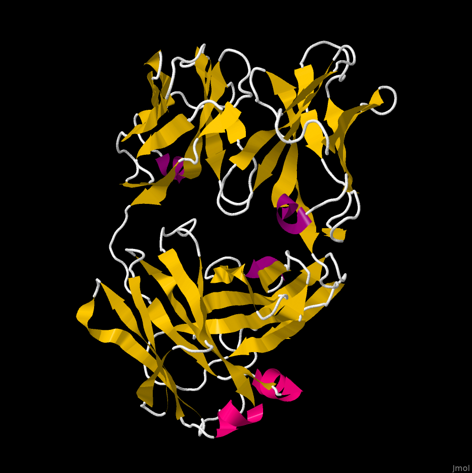
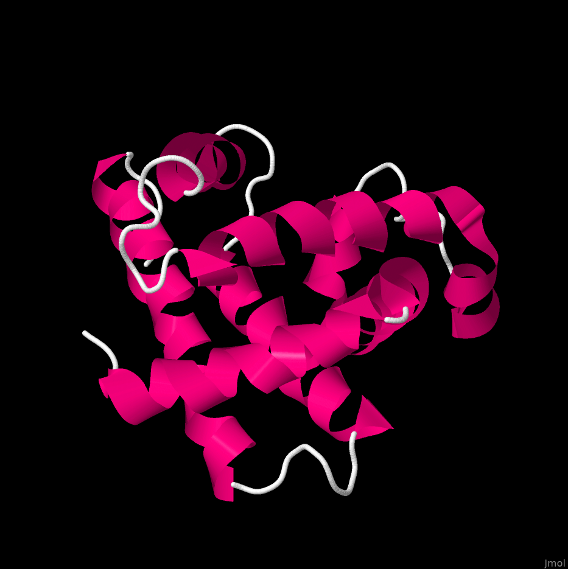
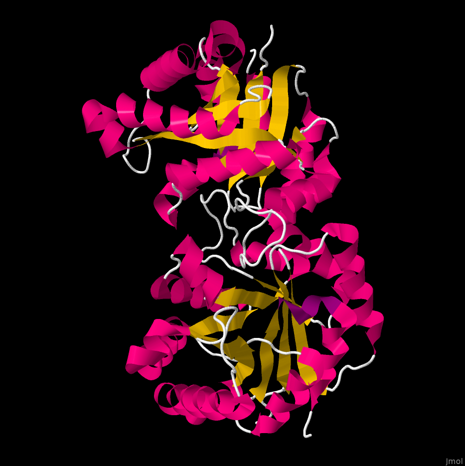

# Usage of Jmol
- Navigate to `Jmol.jar`
- Pass args to `Jmol.jar`
```bash
java -jar Jmol.jar -s script.spt # runs jmol jar with options in script.spt
java -jar Jmol.jar <id>.pdb # runs jmol jar and opens <id>.pdb
java -jar Jmol.jar -h # help 
```

In the `script.spt` you can pass args line by line:

Example of `script.spt`
```
load "1crn.pdb"  # load .pdb into Jmol
select all 
wireframe off  # turn off the default display style
spacefill off  
color structure  # add color to secondary structure
cartoon on  # enable cartoon mode (for secondary structure)
write PNG "1crn_cartoon.png"  # save image to .png
```

# Results
## 1BAF


**Klasifikation nach Sekundärstrukturgehalt**:
- Kaum Alpha-Helix, viel Beta-Faltblatt
- SCOP:*All beta proteins*: https://scop.berkeley.edu/sunid=19779
- Fold:  b.1: Immunoglobulin-like beta-sandwich
- CATH Superfamily: Immunoglobulins: https://www.cathdb.info/version/v4_3_0/superfamily/2.60.40.10

## 1MBN


**Klasifikation nach Sekundärstrukturgehalt**:
- Nur Alpha-Helix
- SCOP: *All alpha proteins* https://scop.berkeley.edu/sunid=15146
- Fold:  a.1: Globin-like 
- CATH Superfamily: Globins: https://www.cathdb.info/version/latest/superfamily/1.10.490.10 

## 1TIM


**Klasifikation nach Sekundärstrukturgehalt**:
- Etwas mehr Alpha-Helix als Beta-Faltblatt
- SCOP: *Alpha and beta proteins*: https://scop.berkeley.edu/sunid=51353 
- Fold: c.1: TIM beta/alpha-barrel
- CATH Superfamily: Aldolase class I: https://scop.berkeley.edu/sunid=51351
 
## 256b


**Klasifikation nach Sekundärstrukturgehalt**:
- Nur Alpha-Helix
- SCOP: *All alpha proteins*: https://scop.berkeley.edu/sunid=140740
- Fold: Fold a.24: Four-helical up-and-down bundle
- CATH Superfamily: Cytochrome c/b562: https://www.cathdb.info/version/latest/superfamily/1.20.120.10
