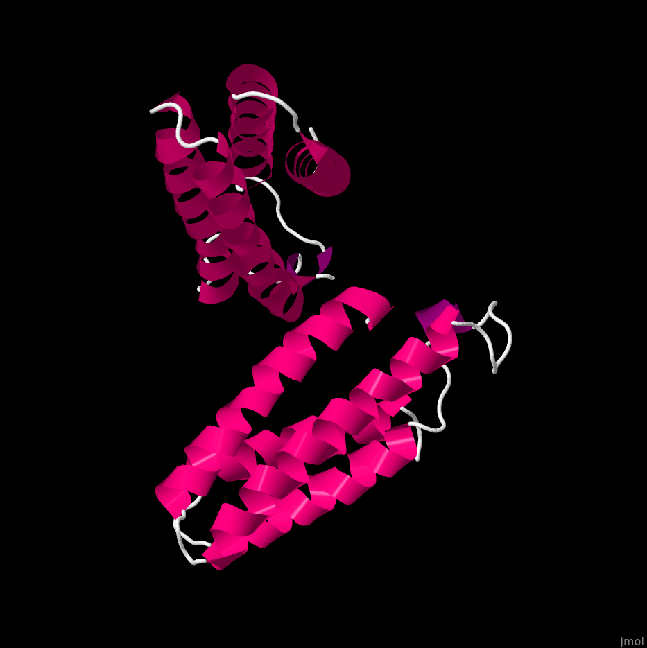

# Usage of Jmol
- Navigate to `Jmol.jar`
- Pass args to `Jmol.jar`:
```bash
java -jar Jmol.jar -s script.txt
```

In the `script.txt` you can pass args line by line:

**EXAMPLE**
```
load "1crn.pdb"  # load .pdb into Jmol
select all 
wireframe off  # turn off the default display style
spacefill off  
color structure  # add color to secondary structure
cartoon on  # enable cartoon mode (for secondary structure)
write PNG "1crn_cartoon.png"  # save image to .png
```

# Results
## 1BAF


**Klasifikation nach Sekundärstrukturgehalt**:
- Kaum Alpha-Helix, viel Beta-Faltblatt
## 1MBN


**Klasifikation nach Sekundärstrukturgehalt**:
- Nur Alpha-Helix
- -> *All alpha proteins*
- https://scop.berkeley.edu/sunid=15146:
    - Folds: 290
## 1TIM


**Klasifikation nach Sekundärstrukturgehalt**:
- Etwas mehr Alpha-Helix als Beta-Faltblatt
- *Alpha and beta proteins*
- Superfamiliy: https://scop.berkeley.edu/sunid=51351
 
## 256b


**Klasifikation nach Sekundärstrukturgehalt**:
- Nur Alpha-Helix
- -> *All alpha proteins*
- Superfamiliy: https://scop.berkeley.edu/sunid=140740


%% TODO:
Ids in den links recherchieren: 


cath family


strand
